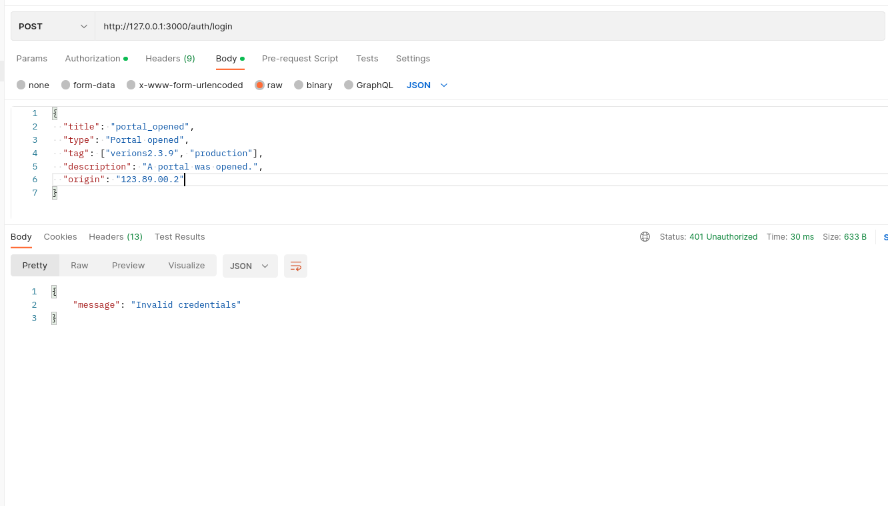
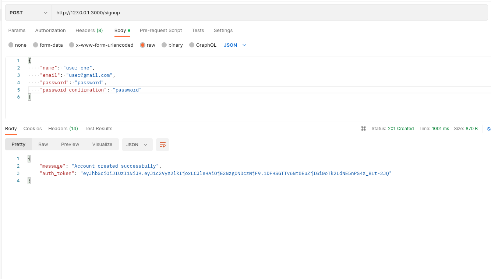
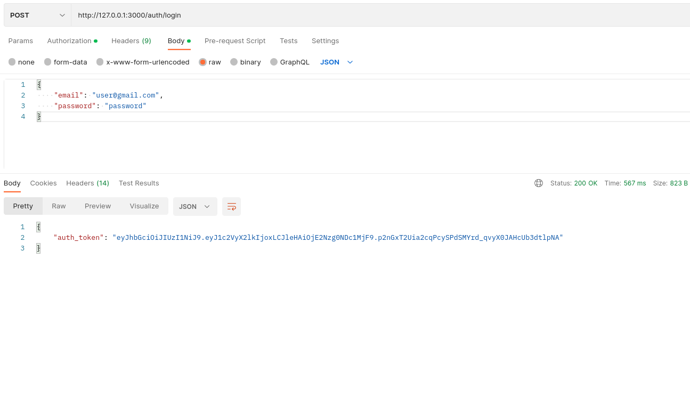
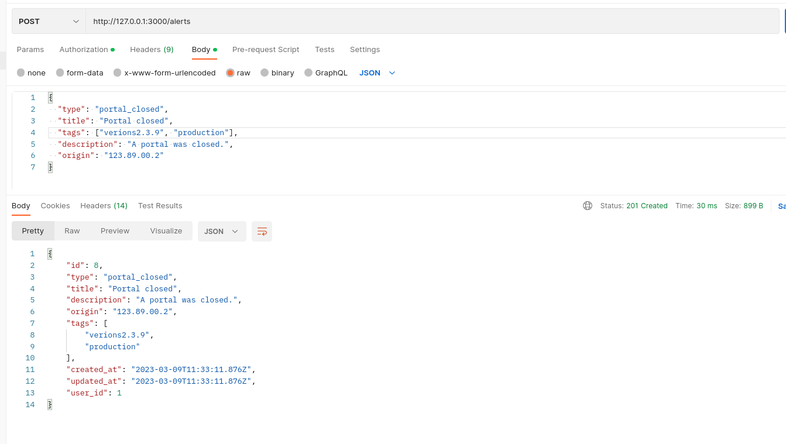
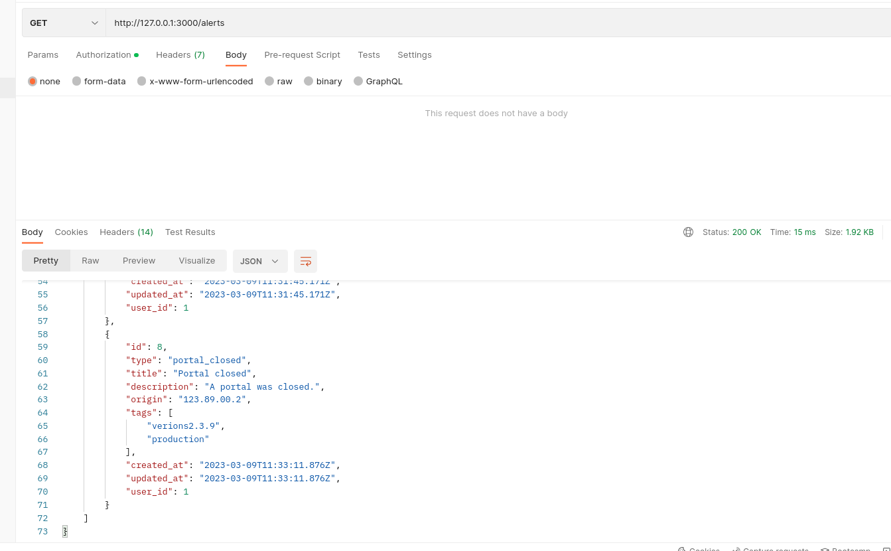
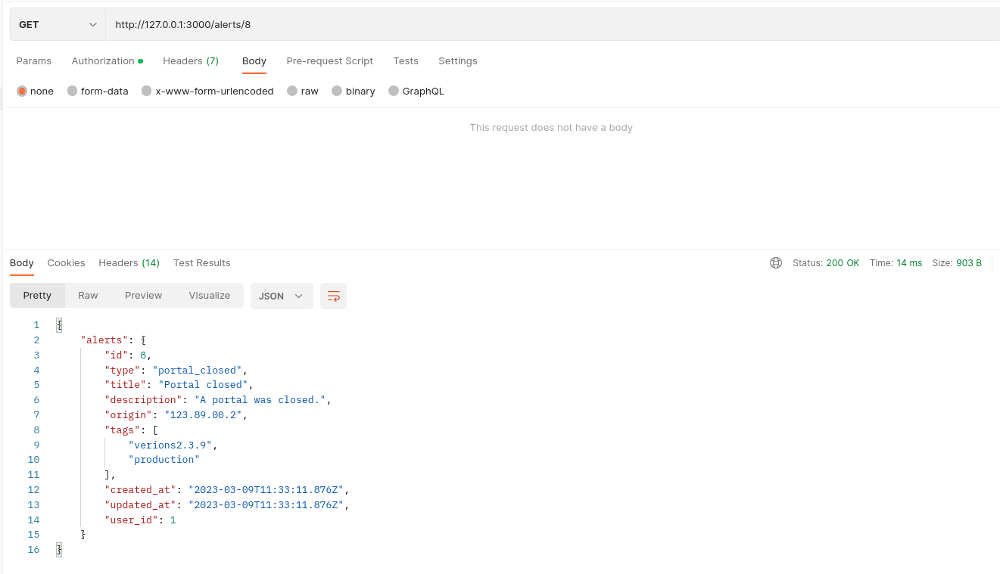

# Alert API

An alert system.

# Clone the Application

```
git clone git@github.com:Njunu-sk/Alert-System.git
```

# Set up the Application

Ruby Version

```
ruby "3.1.2"
```

Bundle Install

```
bundle install
```

Run migrations

```
bundle exec rails db:reset
```

Run spec file

```
bundle exec rspec
```

# Requirements

## All pages should be authenticated

Anoymous user trying to create an alert



### Authenticate User

Sign Up a new User



Sign In a User



## JSON API that can create alert into a database

- Only alerts with types `["portal_opened", "portal_closed"]` should be saved in the database



## JSON API that can list all alerts



## JSON API that can list an alert



